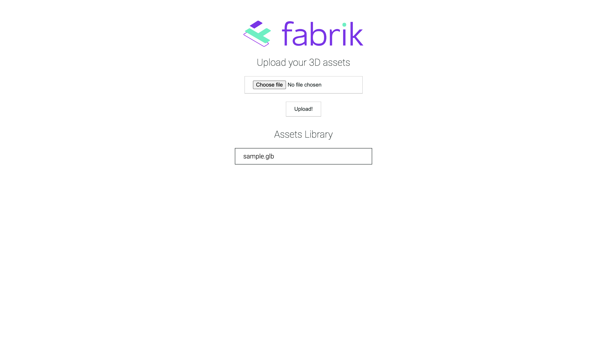

# Fabrik 3D Gallery

This project aims at providing a dashboard that supports uploading 3D file assets and viewing them.

The project is divided into two parts :

1. Server - NODE JS Backend
1. UI - Frontend built with HTML, CSS and Javascript

## How to run

### Server

```
cd fabrik-server
```

Install dependencies

```
npm install
```

Run express server at port 3000

```
npm run dev
```

### UI

```
cd fabrik-ui
```


Open `index.html` in your browser.


## Screenshots




